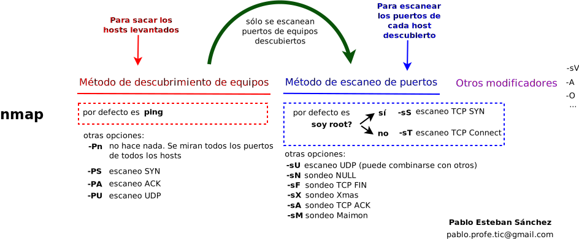

# Comando nmap

## 1. Introducción
NMAP es una herramienta para el análisis de puertos. En realidad se trata de una herramienta muy compleja y cómo tal, puede usarse con muchos propósitos. Nosotros la vamos a usar para detectar máquinas levantadas en una red, y analizar el estado de puertos y sistemas operativos de una máquina.

Además de explicar un poco en qué consiste nmap, la idea es también proponer una metodología de uso. Esta metodología consiste en una serie de pasos que se detallan a continuación y tiene los siguientes pasos:
1. Analizar qué máquinas están levantadas en una red. Mediante las **técnicas de descubrimiento de equipos**.
2. Escanear puertos. Mediante las ténicas de **escaneo de puertos**
3. Escaneo de puertos en detalle de una máquina, mediante el **Escaneo de puertos y servicios**
4. Escanear el sistema operativo de una máquina 

**Seleccionar objetivo**
Podemos escanear una ip sólamente:
```bash
nmap -sP 192.168.0.1
```

Una red completa:
```bash
nmap -sP 192.168.0.0/24
```

Un rango de IPs:
```bash
nmap -sP 192.168.0.1-10
```

Más rangos. En concreto, de 192.168.0.1 a 192.168.0.10, más 192.168.1.1 a 192.168.1.10, más 192.168.2.1 a 192.168.2.10
```bash
nmap -sP 192.168.0-2.1-10
```

Algunos parámetros:
* `-v`: salida "verbose", es decir, con más detalle.
* `-n`: No realizar resolución de nombres (ya que usa DNS y puede resultar en un análisis lento).


## 2. Técnicas para descubrimiento de equipos
Técnicas que no escanean puertos, sólo se limitan a detectar equipos levantados en una red.

### 2.1. Sondeo Ping `-sP`
También llamado **barrido ping**. Hace un ping a cada equipo de la red especificada, y nos devuelve un listado de los equipos que están levantados.
Por ejemplo, si quiero ver todos los equipos de la red 102.168.1.0/24:
```bash
nmap -sP 192.168.1.0/24
``` 

## 3. Estructura general del comando nmap
Al lanzarlo, primero se descubren equipos levantados, y luego, sobre esos equipos, se realiza un escaneo de puertos. Ahora bien, es posible elegir cómo se hace ese descubrimiento, y cómo se hace el escaneo.

La siguiente imagen resume las posibilidades:


En el apartado 4 veremos métodos de **descubrimiento de equipos**, y en el 5, **métodos de escaneo de puertos**.

## 4. Métodos de descrubrimiento de equipos

### 4.1. No hacer descubrimiento `-Pn`
Consiste en no hacer nada por descubrir equipos, y en la siguiente fase, se escanearan los puertos de todas las máquinas del rango que hayamos puesto.

```bash
nmap -Pn 192.168.1.0/24
```

### 4.2. Sondeo Ping TCP SYN `-PS`
Se trata de un escaneo rápido. Para comprobar si un sistema está activo, envía un paquete con el flag SYN activo al puerto 80. Aquí pueden pasar 2 cosas:
    * El servidor responde con el flag RST activo: el puerto se encuentra cerrado, pero el equipo está activo (de hecho, te ha contestado!)
    * El servidor responde con un un segmento con los flags SYN y ACK activados: el equipo está activo y el puerto 80 abierto!
    * El servidor no responde: o hay un cortafuegos, o no hay nadie en esa ip.
```bash
nmap -PS 192.168.1.0/24
```

### 4.3. Sondeo Ping TCP ACK `-PA`
Muy similar al Ping TCP SYN, pero en lugar del flag SYN, activa el ACK. Puede servir para evitar algunos cortafuegos, en caso de que te falle el Ping TCP SYN.
```bash
nmap -PA 192.168.1.0/24
```

### 4.4. Sondeo UDP `-PU`
Similar a los anteriores, pero enviando un datagrama UDP para comprobar si hay alguien escuchando tras una ip. La principal ventaja de este tipo de sondeos es que atraviesan cortafuegos y filtros que sólo analizan TCP. 
Debe ejecutarse como root.

```bash
nmap -PU 192.168.1.0/24
```

## 5.Técnicas de escaneo de puertos
Sólo puedes usar una técnica en un momento determinado, a excepción del escaneo UDP `-sU`, que puede combinarse con cualquiera de los sondeos TCP.

### 5.1. Escaneo **TCP SYN** o **Half Open** - `-sS`
**Sólo si lo lanzas como root!**. Escaneo de puertos rápido y sigiloso, ya que trata de iniciar una conexión TCP (activando el flag SYN), pero no la culmina. Es decir, no contesta al SYN + ACK del receptor (si lo hubiera). Es rápido porque no completas el Three-Way handshake y sigiloso porque generas menos ruido en la red.

```bash 
    sudo nmap -sS 192.168.1.1
```
o al ser opción por defecto si eres root:
```bash 
    sudo nmap 192.168.1.1
```

### 5.2. Escaneo **TCP Connect** `-sT`
Para cada puerto, ejecuta el algoritmo Three-Way handshake completo. Es la opción por defecto si no has lanzado nmap como root. Es más lento que el TCP SYN, y genera más ruido en la red.
Ejemplo de uso:
```bash 
    nmap -sT 192.168.1.1
```
o al ser opción por defecto si no eres root:
```bash 
    nmap 192.168.1.1
```

### 5.3. Sondeo de puertos UDP `-sU`
Parámetro `-sU`. Es el único que puede combinarse con otros sondeos TCP.

Ejemplos de uso:
```bash 
    sudo nmap -sU 192.168.1.1
```

### 5.4. Otros sondeos TCP
Aunque los más usados son el TCP SYN y el TCP Connect, existen otros sondeos que funcionan activando otros flags y con otros procedimientos especiales, que en algunos casos pueden dar mejores resultados. Aunque no son el objetivo de esta guía, también se incluyen:

* **Sondeo TCP Null** `-sN`

    todas las flags a 0.
    ```bash
        nmap -sN 192.168.1.1
    ```
* **Sondeo TCP FIN** `-sF`

    Activa sólo el flag fin
    ```bash
        nmap -sF 192.168.1.1
    ```
* **Sondeo TCP Xmas** `-sX`

    Activa los flags FIN, PSH y URG, 'iluminando el paquete como si fuera un árbol de navidad' ... eso dice la documentación.
    ```bash
        nmap -sX 192.168.1.1
    ```
* **Sondeo TCP ACK** `-sA`

    Fija la bandera ACK
    ```bash
        nmap -sA 192.168.1.1
    ```
* **Sondeo Maimon** `-sM`

    Fija la bandera ACK y FIN, tratando de provocar una respuesta con un RST. Recibe este nombre por la persona que lo inventó.
    ```bash
        nmap -sM 192.168.1.1
    ```


## 6. Escaneo de puertos y servicios
Nmap, mediante el tipo de respuesta recibida, puede darte una probabilidad de cuál es el sistema operativo remoto o algún servicio. 
Si no indicas nada, puedes escanear todos los puertos, pero también puedes ir a por algunos en concreto, usando el parámetro `-p`:
* `-p puerto`: para inspeccionar un puerto concreto. Admite un rango de puertos (Por ejemplo, `-p 80-100`)

### 6.1. Detección de versiones `-sV`
El parámetro es `-sV`:

```bash
nmap -sV 192.168.1.1
```
A esto, podemos añadirle varios modificadores:
* **`--allports`**: escanea un rango de puertos mayor.
    ```bash
    nmap -sV --allports 192.168.1.1
    ```
* **`--version-intensity <intensidad>`**: Fija la intensidad en la detección de versiones. `<intensidad>` puede ir de 0 a 9, siendo el valor por defecto 7. A más intensidad, más probabilidad de encontrar detalles del servicio asociado a un puerto, pero más ruidoso.:

```bash
nmap -sV --version-intensity 0 192.168.1.1
```
o por contra:

```bash
nmap -sV --version-intensity 9 192.168.1.1
```


### 6.2. Escaneo de servicios y Sistema operativo `-A`
La opción `-A` escanea el tipo y versión del sistema opetativo y la versión de los servicios asociados a los puertos abiertos. `-sV` sólo te devuelve la versión de los servicios, así que usaremos `-A` por ser más completa:
```bash
nmap -A 192.168.1.1
```


## 7. Detección del sistema operativo
### 7.1. Obtención del sistema operativo.
Tienes que ser root!

```bash
nmap -O 192.168.1.1
```
Si quieres probar esto a lo bruto (recuerda que bruto = poco sigiloso), puedes añadir `--osscan-guess`:
```bash
nmap -O --osscan-guess 192.168.1.1
```


