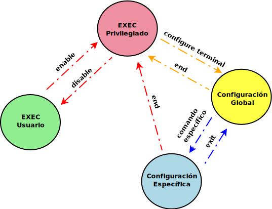

# Comandos Cisco CLI

Aunque podéis encontrar en Internet infinidad de manuales mucho más completos que este, pretendo compilar aquí las acciones básicas con dispositivos Cisco de la manera más resumida posible, y ajustándose a lo que necesitamos en clase

## 1. Navegación entre los distintos modos
Tienes que entender Cisco CLI como un sistema operativo en modo texto para dispositivos Cisco. Tiene infinidad de comandos, y como te puedes imaginar, unos son más delicados que otros en el sentido de que alteran partes comprometidas del sistema. Esto hace necesario plantear un sistema de privilegios.

En Cisco CLI se consigue por medio de los **modos de ejecución**. La siguiente figura muestra un diagrama de estados donde se aprecian los distintos modos, y el comando necesario para pasar de uno a otro:


Cuando te conectas a un dispositivo cisco, lo haces en modo **EXEC usuario**. Aquí tienes un conjunto reducido de comandos que **no requieren permisos especiales** (hacer un ping, mostrar alguna configuración básica, ...). 
Mediante el comando **`enable`**, pasas al modo **EXEC privilegiado**, que te permite ejecutar comandos más comprometidos: hacer copias de seguridad de la configuración, arrancar el asistente de configuración, .... Para volver al modo **EXEC usuario**, tienes que ejecutar **`disable`** 
En resumen, creo que la figura anterior es bastante explicativa. De todos modos:
* **EXEC usuario**: comandos sin privilegios
* **EXEC privilegiado**: conjunto de comandos de gestión (copias de seguridad de la configuración, visualización de parámetros del dispositivo, ...) que requieren privilegios.
* **Configuración Global**: comandos de configuración global del dispositivo. Ej. cambiar la hora, el nombre del dispositivo, el motd...
* **Configuración específica**: Para configurar elementos individuales: una interfaz de red, una línea vty, un puerto de un switch, ...

Otra cosa importante, es que según el modo en el que estés, cambia el promt del sistema (ese texto que aparece en la consola a la espera de comandos)

Imagina que el nombre de nuestro dispositivo es *asir1a*. En este caso tendremos de promt:
* **asir1a>** en el modo EXEC de usuario
* **asir1a#** en el modo EXEC privilegiado
* **asir1a(config)#** en el modo de configuración global
* **asir1a(config-x)#** en el modo de configuración específico, siendo x el elemento a configurar (una interfaz, un puerto, ...)

Cuando escribamos un comando en este manual, siempre irá acompañado del promt para que sepamos en qué modo hay que ejecutarlo.

Los **comandos para navegar entre un modo u otro**, los tienes en el diagrama anterior.


## 2. Comando show
El comando `show` va acompañado de algún parámetro. Por ejemplo, `show interfaces` muestra la configuración de las interfaces. Sin embargo, estos parámetros que acompañan al comando varían dependiendo del modo (usuario, exec privilegiado, …) en el que nos encontremos.

Para saber qué cosas puedes mostrar en cada momento, usa el operador `?`:
```bash
show ?
```
Esto te devolverá la lista de cosas que puedes mostrar según el **modo** en el que te encuentres.

Algunos ejemplos de cosas a mostrar según el modo:

* En **EXEC de usuario**, mostrar información hardware y software del dispositivo (versión del ios, del procesador, características HW del dispositivo, …)
    ```bash
    asir1a> show version
    ```
* En **EXEC privilegiado**, mostrar configuración de ejecución en RAM (o sea, no guardado)
    ```bash
    asir1a# show running-config
    ```
* En **EXEC privilegiado**, mostrar configuración que se cargará al arrancar el dispositivo
    ```bash
    asir1a# show startup-config
    ```
* En **EXEC privilegiado**, información sobre las interfaces físicas y virtuales disponibles
    ```bash
    asir1a# show ip interface brief
    ```
* En **EXEC privilegiado**, mostrar información sobre las interfaces
    ```bash
    asir1a# show interfaces
    ```

## 3. Cambiar el nombre al dispositivo
Recuerda que debes hacer en modo de **configuración global** (Fíjate en el promt):
* Cambia el nombre del dispositivo
    ```bash
    asir1a(config)# hostname nombre_del_dispositivo
    ```
* Resetea el nombre del dispositivo:
    ```bash
    asir1a(config)# no hostname
    ```

## 4. Proteger con contraseña el modo EXEC privilegiado
Recuerda que en este modo había comandos más *delicados*. Es bueno protegerlo con contraseña para evitar accesos no autorizados.
Hay 2 maneras de establecer contraseña: 1. en texto plano (no seguro), 2. cifrada (seguro)
1. Forma no segura (en texto plano)
    ```bash
    asir1a(config)# enable password contraseña
    ```
2. Forma no segura (en texto plano)
    ```bash
    asir1a(config)# enable secret contraseña
    ```
El primero método almacena la contraseña en el fichero de configuración en texto plano, y la segunda forma, cifrada. Es evidente que el segundo método es más seguro y recomendable, pero es mi deber enseñarte los 2.

## 5. Proteger el acceso por consola
Hay varias maneras de acceder al dispositivo para configurarlo. Las más comunes son mediante **consola** (línea CTY), y a través de **servicios de red** (líneas VTY) como telnet y ssh. Estos tipos de acceso se conocen en cisco como **líneas (line)**

Acceder por **consola** consiste en conectarte al dispositivo usando un cable de consola, mediante el protocolo RS232. Tambíen es algo crítico que debería ser protegido.

Los comandos para conseguirlo son:
```bash
asir1a(config)# line console 0
asir1a(config-line)# password mi_contraseña
asir1a(config-line)# login
```
* el comando `line console 0` sirve para acceder al modo de configuración de línea de la consola. El cero se utiliza para representar la primera (y en la mayoría de los casos la única) interfaz de consola.
* El comando, `password mi_contraseña`, establece la contraseña.
* El comando `login` configura el dispositivo para que pida esa constraseña al conectar por consola. 
Con esto, la próxima vez que accedamos al dispositivo por consola, se nos pedirá esta contraseña.


## 6. Establecer un MOTD
MOTD significa Message Of The Day. Se trata de una especie de aviso que le sale al usuario cuando se conecta por consola o accede por SSH/Telnet al dispositivo.
Se configura así:
```bash
asir1a(config)# banner motd # mensaje #
```

## 7. Encriptar contraseñas en el dispositivo
El comando de configuración global `service password-encryption` le indica al dispositivo que cifre las contraseñas que se guardan en su archivo de configuración.
```bash
asir1a(config)# service password-encryption
```

## 8. Gestión de la configuración de Inicio
Recuerda que todos los cambios que hagamos, se hacen en memoria y por tanto, son volátiles. A no ser que los guardemos en la nvram del dispositivo, estos cambios se perderán en cuanto lo apaguemos. 
Podemos guardar la configuración actual como configuración de inicio con el siguiente comando:
```bash
asir1a# copy running-config startup-config
```

Podemos borrar la configuración de inicio de la siguiente manera:
```bash
asir1a# erase startup-config
```

Por último, podemos borrar también toda la información de configuración de VLANs que tengamos hecha mediante;
```bash
asir1a# delete vlan.dat
```

## 9. Configurar interfaz virtual de un switch (SVI)
Un switch opera a nivel 2, sin embargo, para propósitos de administración, incluye una **interfaz virtual (SVI)**, para poder administrarlo remotamente por red (vía telnet, ssh, web). Para activar dicha interfaz, ejecutamos los siguientes comandos:
1. Accedemos a la vlan 1, que es la de administración
    ```bash
    asir1a(config)# interface vlan 1
    ```
2. Esteblecemos una ip y una máscara para la interfaz seleccionada en el paso anterior
    ```bash
    asir1a(config-if)# ip address DIRECCION_IP MASCARA_DE_RED
    ```
3. Activamos la interfaz la interfaz
    ```bash
    asir1a(config-if)# no shutdown
    ```
Por ejemplo, para poner a un switch la ip 192.168.21.250:
```bash
asir1a(config)# configure vlan 1 
asir1a(config-if)# ip address 192.168.21.250 255.255.255.0
asir1a(config-if)# no shutdown
```


## 10. Configurar acceso vía telnet
Como hemos dicho antes, hay varias maneras de acceder al dispositivo para configurarlo. Las más comunes son mediante **consola** (línea CTY), y a través de **servicios de red** (líneas VTY) como telnet y ssh. Estos tipos de acceso se conocen en cisco como **líneas (line)**.

Las líneas **VTY** son las líneas de terminal virtual que se usan solamente para controlar las conexiones Telnet/SSH entrantes. Son virtuales ya que no hay hardware relacionado con ellas. 

Para configurar el acceso vía Telnet, recuerda que lo primero es tener configurada una ip para acceder al dispositivo. Si estás trabajando con un switch de nivel 2, necesitas configurar la interfaz svi (ver apartado 6), si por contra, estás con un router, necesitas poner ip a una interfaz física.

Normalmente, hay 5 líneas VTY numeradas de 0 a 4. Piensa en estas líneas como un pool de conexiones permitidas. De manera que, puedes configurar cada una de ellas, incluso con una contraseña distintas. Nosotros por simplicidad, dejaremos todas igual. 
En el siguiente ejemplo, configuramos de la línea 0 a 15.

```bash
asir1a(config)# line vty 0 15 
asir1a(config-line)# password contraseña
asir1a(config-line)# login
asir1a(config-line)# transport input telnet
``` 

Hecho esto, desde otro dispositivo con ip (un host, un switch, un router), podemos hacer telnet al dispositivo anteriormente configurado. Por ejemplo, si hemos configurado la 192.168.1.1:
```bash
PC>telnet 
Trying 192.168.1.1 ...Open
```

## 11. Configurar acceso SSH
Este acceso es más complicado que el acceso telnet. De nuevo, recuerda que lo primero es tener configurada una ip para acceder al dispositivo. Si estás trabajando con un switch de nivel 2, necesitas configurar la interfaz svi (ver apartado 12), si por contra, estás con un router, necesitas poner ip a una interfaz física

Necesitamos crear un usuario (Vamos a exigir autenticación con contraseña local):
```bash
asir1a(config)#username asir1a secret 12345
```
PAra generar las claves RSA (que haremos después), necesitamos que nuestro dispositivo tenga un nombre distinto del genérico (Switch o Router) con el que viene configurado por defecto.

Cambiamos el nombre del dispositivo:
```bash
asir1a(config)# hostname asir_sw
```

Poner a la máquina un nombre de dominio:
```bash
asir1a(config)#ip domain-name iescelia.org
```

Generar claves con encriptación rsa:
```bash
asir1a(config)#crypto key generate rsa
```

Configurar las líneas de acceso:
```bash
asir1a(config)# line vty 0 15
asir1a(config-line)# transport input ssh
asir1a(config-line)# login local
asir1a(config)# exit
```

Una vez hecho esto, desde cualquier pc o dispositivo podemos ejecutar:
```bash
PC>ssh -l asir1a 192.168.1.1
Open
Password: 

asir1c>
```

## 12. Configurar dhcp en un router/switch
Podemos configurar un servidor DHCP en un router, o en un switch que lo permita (en packet tracer, switch 2950-24 no lo permite, pero el 2950T sí). 
Partimos de que tenemos las interfaces del switch (ver apartado 12) o del router (apartado 15.d) configuradas. Vamos a hacerlo para la red 192.168.1.0/24.
En cisco, se establecen las reglas dhcp por ámbitos o pools. Un pool es una configuración dhcp específica y podemos tener varias simultáneas con distintas políticas: distintas redes, rangos de ips, dns, … 
En nuestro ejemplo, crearemos un pool llamado asirPool:
```bash
asir1a(config)#ip dhcp pool asirPool
```
Establecemos la red afectada y su máscara:
```bash
asir1a(dhcp-config)#network 192.168.1.0 255.255.255.0
```
Establecemos el gateway por defecto:
```bash
asir1a(dhcp-config)#default-router 192.168.1.1
```
Establecemos los servidores dns:
```bash
asir1a(dhcp-config)# dns-server 8.8.8.8
```
Excluimos ciertas ips:
```bash
asir1a(dhcp-config)#exit
asir1a(config)#ip dhcp excluded-address 192.168.1.1 192.168.1.10
```
Establecer duración de la concesión (no funciona en packet tracer):
```bash
lease {días [horas] [minutos] infinite} 
```

Para desactivarlo:
```bash
asir1a(config)#no service dhcp
```

Para activarlo:
```bash
asir1a(config)# service dhcp
```

Ver lista de direcciones IP concedidas y sus MACs:
```bash
asir1a# show ip dhcp binding
```
Ver eventos dhcp ocurridos en el servidor:
```bash
asir1a# debug ip dhcp server events
```